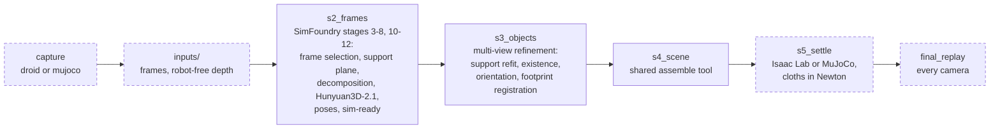
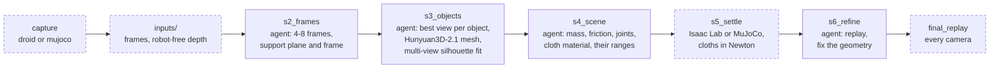

# R2S2R

Real-to-sim from a robot's own cameras. A capture (calibrated images from an exterior
camera, the wrist camera or both, with the joint states, every pose in the robot's base
frame) becomes a scene for Isaac Lab or MuJoCo: the objects on their support, rigid,
articulated (joints with damping, friction and a spring) or cloth (simulated in Newton),
each with a mass and a friction (and the range each may take), settled under gravity.
Two methods, **fixed** and **agentic**, share the run directory, the last stages and the
viewer. MuJoCo worlds stand in for the real world in local tests.

## Quick start

```bash
git clone --recurse-submodules https://github.com/weiqianwang123/R2S2R.git && cd R2S2R
bash scripts/setup/install.sh                    # .venv (uv, Python 3.11): r2s2r, Isaac Sim 5.1, Isaac Lab
bash scripts/setup/link_simfoundry_resources.sh  # a SimFoundry install's models; its conda envs run SAM3, Hunyuan3D-2.1, CoACD, FoundationStereo
bash scripts/setup/fetch_mujoco_assets.sh        # MuJoCo robots and objects
bash scripts/setup/fetch_robotiq_isaac.sh        # Robotiq's 2F-85 for Isaac (git-lfs)
bash scripts/setup/fetch_robodojo_x5.sh          # RoboDojo's ARX X5
bash scripts/setup/install_newton.sh             # conda env "newton", for cloths
source .venv/bin/activate                        # and Codex or Claude Code on the PATH
```

```bash
r2s2r capture droid EPISODE --calib CALIB --out CAP     # a raw DROID episode, KarlP/droid calibration
r2s2r capture mujoco --world fr3_table --out CAP         # or physcoder_box_block
r2s2r run CAP --method agentic --out RUN                 # or fixed; --agent claude; --sim mujoco; --cameras ext2 wrist
r2s2r viewer RUN                                         # live, http://localhost:8765
r2s2r eval RUN --capture CAP                             # a MuJoCo capture: against its ground truth
r2s2r pick RUN/s5_settle/scene --capture CAP --out PICK  # the pick test, in MuJoCo and Isaac Lab
r2s2r pick RUN/s5_settle/scene --target towel --sims scene --out PICK  # any scene, a cloth too
```

Checks: `./run_ci_checks.sh` (format, mypy, pylint, pytest; no GPU or agent needed).

## Pipelines

A run is one directory (`inputs/`, a directory per stage, `run.json`); a stage is
skipped while its product is valid and newer than the one before. Both methods end the
same way (dashed): the scene settles in the run's simulator, cloths then in Newton, and
the recording is replayed against it from every camera.

**Fixed**: SimFoundry ([our fork](third_party/SimFoundry), its VLM calls through Codex)
rebuilds the scene from one frame; the depth of every candidate frame then corrects it.



**Agentic**: a coding agent, Codex (`gpt-6-astra`) or Claude Code (`--agent claude`,
`claude-opus-5-5`), does stages 2, 3, 4 and 6, one session each with its
[brief](src/r2s2r/pipeline/agentic/briefs), through `r2s2r tool` (`frames segment crop
points support generate fit check assemble settle replay`). The run checks every product
and resumes the session while it is invalid.



## Robots

| `fr3_robotiq` | `ur5e_2f140` | `dual_x5` |
|:-:|:-:|:-:|
|  |  |  |
| FR3 + Robotiq 2F-85, the lab's DROID robot | UR5e + Robotiq 2F-140, [PhysCoder](https://github.com/Jaraxxus-Me/physcoder)'s | [RoboDojo](https://robodojo-benchmark.com)'s two ARX X5 arms |
| DROID's ZED `ext1`, `ext2`, `wrist` (stereo); MuJoCo `fr3_table`: `ext1`, `wrist` | `wrist` (optional `ext1`); MuJoCo `physcoder_box_block` | both arms' joints, left then right |
| Menagerie's FR3; Isaac Lab: the Panda (same kinematics) with the FR3's limits and Robotiq's own 2F-85 | PhysCoder's MJCF and USD, by path | RoboDojo's X5A URDF, two as one, its drives |

A robot is one `RobotSpec` module in [`src/r2s2r/robots/`](src/r2s2r/robots), registered
in `ROBOTS`; a capture names its robot.

## Result

The final scene replayed in Isaac Lab, the robot at its recorded states, beside the
recording. A real DROID episode, fixed method (`ext2` + wrist):


PhysCoder's UR5e scene in MuJoCo, agentic method, from the wrist camera alone:


| method | robot, capture | cameras | time | against the ground truth | replay depth residual |
|---|---|---|--:|---|---|
| fixed | DROID's Franka, real (IRIS) | ext2 + wrist | 11 min | – | ext2 2 mm, wrist 4 mm |
| fixed | UR5e, MuJoCo `physcoder_box_block` | wrist | 17 min | the box's floor taken for the table: box lost | wrist 52 mm |
| agentic | UR5e, MuJoCo `physcoder_box_block` | wrist | 41 min | centres within 0.1 cm, sizes within 0.1 cm | wrist < 1 mm |

Ground truth: `r2s2r eval` of the final scene. Residual: the median absolute depth
difference between the replay and the recording, over a camera's frames. The viewer:


## Layout

```
src/r2s2r/
  cli.py        r2s2r capture | run | tool | viewer | eval | pick
  structs.py    Capture, SceneSpec: plain data, JSON on disk; workspace.py: the run directory
  capture/      a DROID episode -> a capture; FoundationStereo depth
  pipeline/     stages and their checks, the run (run.py); fixed/ (SimFoundry), agentic/ (the agent and its briefs)
  tools/        r2s2r tool: segmentation, geometry and fitting, meshes and assembly, checks
  robots/       one module per robot; their models, IK, the robot cut out of depth
  sim/          settle and replay in Isaac Lab (isaac.py, isaaclab/) or MuJoCo (mujoco.py); cloths in Newton (cloth.py)
  testbed/      MuJoCo worlds as the real world: recording, scoring, the pick test
  viewer/       the live web viewer
scripts/        Isaac Lab entry points, the conda envs' jobs, setup
third_party/    SimFoundry, our fork (a submodule)
```
