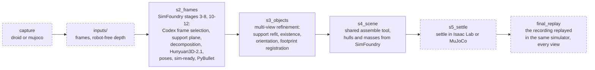
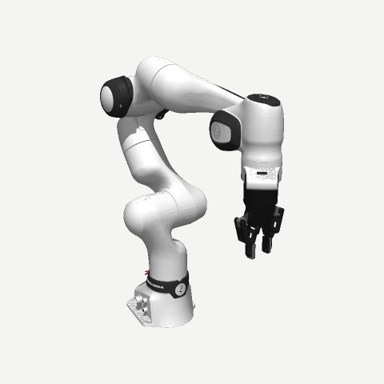
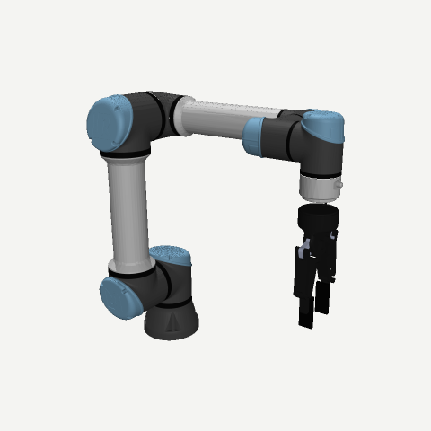
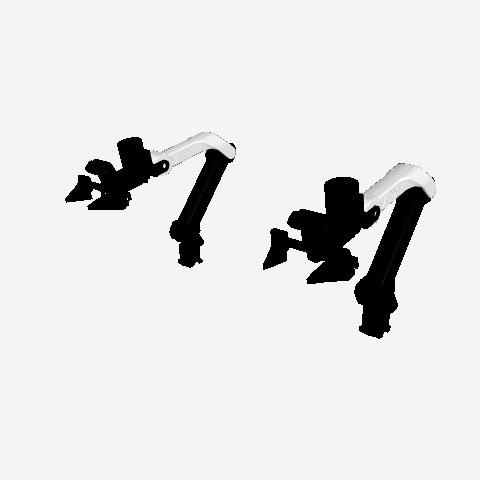
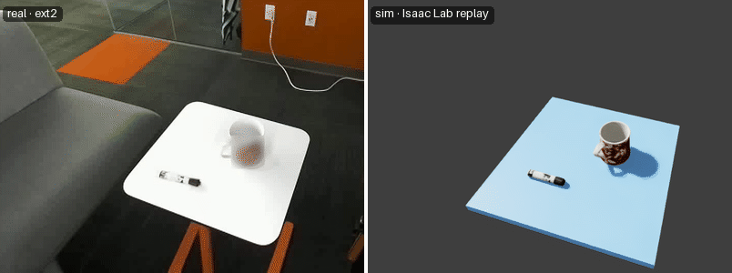
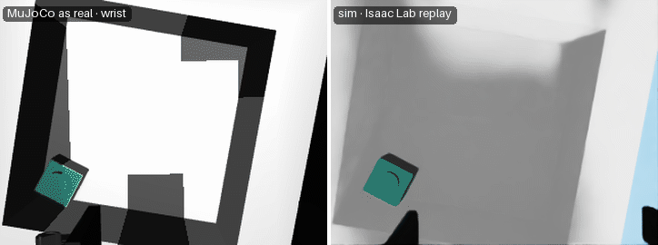
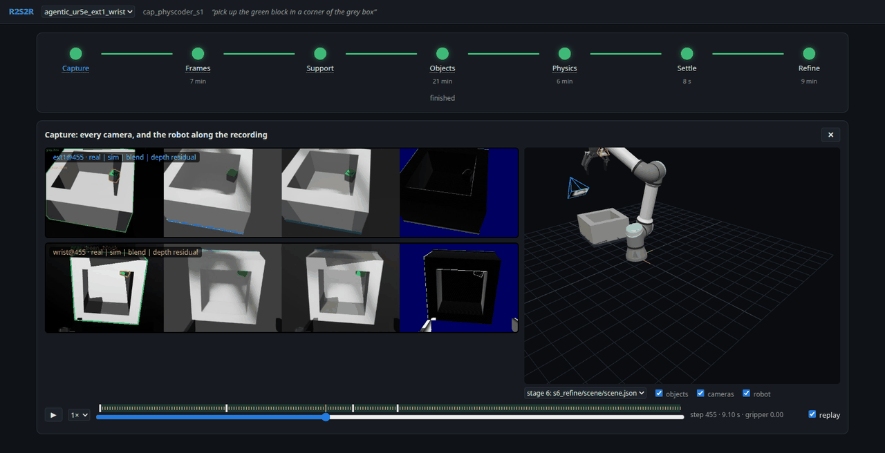

# R2S2R

Real-to-sim from a robot's own cameras. In: what the robot records, calibrated images
from one exterior camera, the wrist camera or both, with its joint states, every pose in
its base frame (a real robot's, or one simulated in MuJoCo). Out: a scene of the objects
on their support, in that base frame, for Isaac Lab or MuJoCo (`--sim`), rigid,
articulated (a lid, a door, a drawer: the agentic method models joints, and how each
moves: its damping, its dry friction, a spring toward a rest) or a cloth (a towel: it
drapes in Newton as the scene settles, and moves in Newton beside MuJoCo as the robot
pinches and lifts it), each with a URDF (and a USD, for Isaac Lab), a mass and a
friction, settled under gravity, on a support in the colour the cameras saw.
Two methods, **fixed** and **agentic**, share the inputs, the run directory, the last
stages and the viewer. MuJoCo worlds stand in for the real world in local tests.

## Quick start

```bash
git clone --recurse-submodules https://github.com/weiqianwang123/R2S2R.git && cd R2S2R
bash scripts/setup/install.sh          # .venv (uv, Python 3.11): r2s2r, Isaac Sim 5.1, Isaac Lab
bash scripts/setup/link_simfoundry_resources.sh  # a SimFoundry install's models and conda envs
bash scripts/setup/fetch_mujoco_assets.sh        # MuJoCo robots and objects
bash scripts/setup/fetch_robotiq_isaac.sh        # Robotiq's 2F-85 for Isaac (git-lfs)
bash scripts/setup/fetch_robodojo_x5.sh          # RoboDojo's ARX X5, for its two-armed robot
bash scripts/setup/install_newton.sh             # conda env "newton": cloths settle there
source .venv/bin/activate              # and the Codex CLI on the PATH
```

SimFoundry's conda envs run SAM3, Hunyuan3D-2.1, CoACD and FoundationStereo.

```bash
r2s2r capture droid EPISODE --calib CALIB --out CAP    # raw DROID episode, KarlP/droid calibration
r2s2r capture mujoco --world fr3_table --out CAP        # or physcoder_box_block
r2s2r run CAP --method fixed --out RUN                  # or agentic; --cameras ext2 wrist; --sim mujoco
r2s2r viewer RUN                                        # live, http://localhost:8765
r2s2r eval RUN --capture CAP                            # MuJoCo capture: vs its ground truth
r2s2r pick RUN/s5_settle/scene --capture CAP --out PICK # MuJoCo capture: pick test, also in Isaac Lab
r2s2r pick RUN/s5_settle/scene --target towel --sims scene --out PICK  # any run: in its own scene
```

## Pipelines

A run is one directory (`inputs/`, `cache/`, a directory per stage, `run.json`); a stage
is skipped while its product is valid and newer than the one before. Dashed: shared.

**Fixed**: SimFoundry ([our fork](third_party/SimFoundry), in its conda envs, its VLM
calls through Codex) rebuilds the scene from one frame; the depth of every candidate
frame then corrects it.



**Agentic**: astra (Codex `gpt-6-astra`, xhigh) does stages 2, 3, 4 and 6, one session
each with its [brief](src/r2s2r/pipeline/agentic/briefs), working through `r2s2r tool`
(`frames segment crop points support generate fit check assemble settle replay`). The
run checks every product and resumes the session while it is invalid.

```mermaid
flowchart LR
  cap["capture<br/>droid or mujoco"] --> inp["inputs/<br/>frames, robot-free depth"]
  inp --> s2["s2_frames<br/>astra: 4-8 frames,<br/>support plane and frame"]
  s2 --> s3["s3_objects<br/>astra: best view per object,<br/>Hunyuan3D-2.1 mesh,<br/>multi-view silhouette fit"]
  s3 --> s4["s4_scene<br/>astra: mass, friction,<br/>joint dynamics;<br/>shared assemble tool"]
  s4 --> s5["s5_settle<br/>settle in Isaac Lab or MuJoCo"]
  s5 --> s6["s6_refine<br/>astra: replay tool,<br/>fix the geometry"]
  s6 --> fr["final_replay<br/>the recording replayed<br/>in the same simulator, every view"]
  class cap,inp,s5,fr shared
  classDef shared stroke-dasharray: 5 4
```



## Robots

| `fr3_robotiq` | `ur5e_2f140` | `dual_x5` |
|:-:|:-:|:-:|
|  |  |  |
| FR3 + Robotiq 2F-85, the lab's DROID robot | UR5e + Robotiq 2F-140 | [RoboDojo](https://robodojo-benchmark.com)'s two ARX X5 arms with their grippers |
| DROID: ZED 2 `ext1` `ext2` + ZED Mini `wrist`, stereo (a DROID episode is taken for this robot); MuJoCo world `fr3_table`: RGB-D `ext1` + `wrist` | [PhysCoder](https://github.com/Jaraxxus-Me/physcoder)'s robot and MuJoCo scene: `wrist` (optional `ext1` at its real front camera) | a capture's joints are both arms', left then right, its gripper position one per arm |
| Menagerie's FR3; in Isaac Lab the Panda + Robotiq (same kinematics) with the FR3's joint limits | PhysCoder's MJCF and USD, used by path from its checkout | RoboDojo's X5A URDF, two of it as one URDF in both simulators, RoboDojo's drives |

A robot is one `RobotSpec` module in [`src/r2s2r/robots/`](src/r2s2r/robots) (its MuJoCo
and Isaac Lab models; its arms, each with its joints, gripper and tool centre point),
registered in `ROBOTS` there; masking, the viewer, Isaac Lab and the pick test (one arm)
take it from the capture.

## Result

The final scene replayed in Isaac Lab, the robot at its recorded states, beside the
recording. A real DROID episode, fixed method (`ext2` + wrist):



PhysCoder's UR5e scene in MuJoCo, agentic method, from the wrist camera alone:



| method | robot, capture | cameras | time | against the ground truth | replay depth residual |
|---|---|---|--:|---|---|
| fixed | DROID's Franka, real (IRIS) | ext2 + wrist | 11 min | – | ext2 2 mm, wrist 4 mm |
| fixed | UR5e, MuJoCo `physcoder_box_block` | wrist | 17 min | the box's floor taken for the table: box lost | wrist 52 mm |
| agentic | UR5e, MuJoCo `physcoder_box_block` | wrist | 41 min | centres within 0.1 cm, sizes within 0.1 cm | wrist < 1 mm |

Ground truth: `r2s2r eval` of the final scene. Residual: the median absolute depth
difference between the replay and the recording, over a camera's frames. The viewer, on
the agentic ext1 + wrist run, replay on:



## Files

```
src/r2s2r/
  cli.py             r2s2r capture | run | tool | viewer | eval | pick
  structs.py         Capture, CameraSpec, FrameRecord, SceneSpec: plain data, JSON on disk
  workspace.py       the run directory: capture copy, frame index, depth cache, run.json
  paths.py           where SimFoundry, the caches, PhysCoder, the conda envs and Codex are
  transforms.py      rigid transforms, quaternions, projection
  assets.py          object URDFs: written, made sim-ready, read back
  mjrender.py        MuJoCo renders from calibrated pinhole cameras
  capture/
    droid.py         a raw DROID episode -> a capture
    stereo.py        FoundationStereo depth for stereo cameras
  pipeline/
    stages.py        stage directories, their products, the checks
    run.py           a method's stages, the shared settle, the final replay
    fixed/           SimFoundry driver; existence, orientation, refinement; Codex VLM
    agentic/         astra's runner and briefs
  tools/             r2s2r tool (cli.py), for both methods and astra; envjobs.py: conda env jobs
    segment.py       SAM3 masks, object crops
    geometry.py      points, support plane and outline, footprints, multi-view mesh fit
    objects.py       Hunyuan3D-2.1 meshes; assembly into a sim-ready scene
    check.py         objects rendered into the recorded frames (MuJoCo, seconds)
  robots/            the registry (__init__.py) and one module per robot
    spec.py          RobotSpec: models, arm joints, gripper, tool centre point
    model.py         a robot's MuJoCo model: pose, kinematics, IK, gripper
    mask.py          the robot cut out of depth, its model at the recorded joints
  sim/               settle and replay in either simulator (__init__.py picks it)
    world.py         what both do the same: gravity, settling, the support's colour,
                     the replay's frames and numbers
    isaac.py         Isaac Lab in its own process: settle, replay, pick
    isaaclab/        inside Isaac Lab: scene, replay and settle, pick
    mujoco.py        MuJoCo in this process: settle, replay
    mjscene.py       a scene in MuJoCo: robot, support, objects with their joints
    cloth.py         cloths in Newton (VBD): settling with the bodies within reach,
                     moving beside a MuJoCo session (the robot pinches and lifts them)
    compare.py       replay renders against the real frames, with numbers
  testbed/           MuJoCo as the real world, for local tests
    worlds.py        fr3_table, physcoder_box_block, with ground truth
    record.py        a capture recorded as a real rig would
    evaluate.py      scenes scored against the ground truth
    policy.py        the robot interface and the pick program (a cloth: pinched);
                     pick.py: the test in MuJoCo, in a capture's world or the scene
  viewer/            live web viewer of runs (HTTP server, run state, GLBs, static/)
scripts/
  isaaclab/          replay.py, settle.py, pick.py: Isaac Lab entry points
  tools/             SAM3, Hunyuan3D, CoACD, FoundationStereo, cloth (Newton) jobs for
                     the conda envs
  setup/             install.sh, link_simfoundry_resources.sh, fetch_mujoco_assets.sh,
                     fetch_robotiq_isaac.sh, fetch_robodojo_x5.sh, install_newton.sh
tests/               pytest, no GPU, SimFoundry or Codex needed (MuJoCo renders: marker gl)
docs/                this README's images: robots/, demo/, viewer.png
third_party/SimFoundry  our SimFoundry fork (branch r2s2r), a submodule
```
